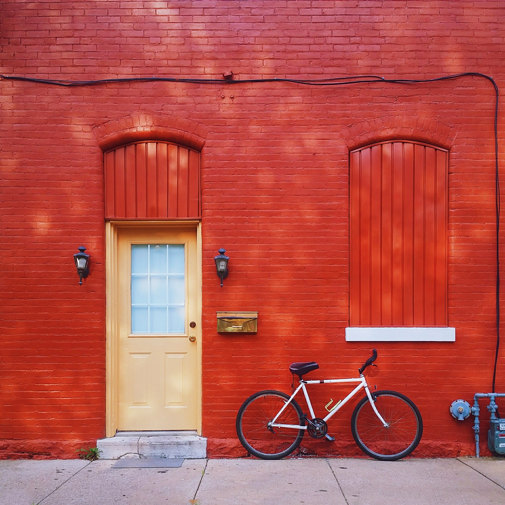

### 课堂作业

##### 1. 打开图像，显示图像，存储图像；对一张图像进行缩放，观察其分辨率，降低灰度分辨率。

###### - 打开图像，显示图像，存储图像；

```python
def part_one():
    """
    打开图像，显示图像，存储图像
    """
    with open("source.jpg", "rb") as fp:
        # open image
        im = Image.open(fp)
        print(im.format, im.size, im.mode)
        # show image
        im.show()
        # save image
        im.save("tmp.jpg")

    with open("tmp.jpg", "rb") as fp:
        # test saved image
        im = Image.open(fp)
        im.show()
```



###### - 对一张图像进行缩放，观察其分辨率

```python
def part_two():
    """
    对一张图像进行缩放，观察其分辨率
    """
    new_size = 200, 200
    with open("source.jpg", "rb") as fp:
        im = Image.open(fp)
        im.thumbnail(new_size, Image.ANTIALIAS)
        im.show()
        im.save("resized_file.jpg", "JPEG")

    # validate resized image
    with open("resized_file.jpg", "rb") as fp:
        im = Image.open(fp)
        print(im.format, im.size, im.mode)
```


###### - 降低灰度分辨率

```python
def part_three():
    """
    降低灰度分辨率
    """
    change = lambda x: 0 if x*0.5 < 1 else int(x*0.5)
    with open("source.jpg", "rb") as fp:
        im = Image.open(fp)
        im.show()
        im = im.convert("L")
        im.show()
        pixels = im.load()
        for i in range(im.size[0]): # for every pixel:
            for j in range(im.size[1]):
                pixels[i, j] = change(pixels[i, j])
        im.show()
```


*****

##### 完整 Code

```python
'''
1. 打开图像，显示图像，存储图像；对一张图像进行缩放，观察其分辨率，降低灰度分辨率。
'''

from PIL import Image

def part_one():
    """
    打开图像，显示图像，存储图像
    """
    with open("source.jpg", "rb") as fp:
        # open image
        im = Image.open(fp)
        print(im.format, im.size, im.mode)
        # show image
        im.show()
        # save image
        im.save("tmp.jpg")

    with open("tmp.jpg", "rb") as fp:
        # test saved image
        im = Image.open(fp)
        im.show()

def part_two():
    """
    对一张图像进行缩放，观察其分辨率
    """
    new_size = 200, 200
    with open("source.jpg", "rb") as fp:
        im = Image.open(fp)
        im.thumbnail(new_size, Image.ANTIALIAS)
        im.show()
        im.save("resized_file.jpg", "JPEG")

    # validate resized image
    with open("resized_file.jpg", "rb") as fp:
        im = Image.open(fp)
        print(im.format, im.size, im.mode)

def part_three():
    """
    降低灰度分辨率
    """
    change = lambda x: 0 if x*0.5 < 1 else int(x*0.5)
    with open("source.jpg", "rb") as fp:
        im = Image.open(fp)
        im.show()
        im = im.convert("L")
        im.show()
        im.save("gray.jpg")

        pixels = im.load()
        for i in range(im.size[0]): # for every pixel:
            for j in range(im.size[1]):
                pixels[i, j] = change(pixels[i, j])
        im.show()
        im.save("downing_gray.jpg")

def main():
    part_one()
    part_two()
    part_three()

if __name__ == "__main__":
    main()
```