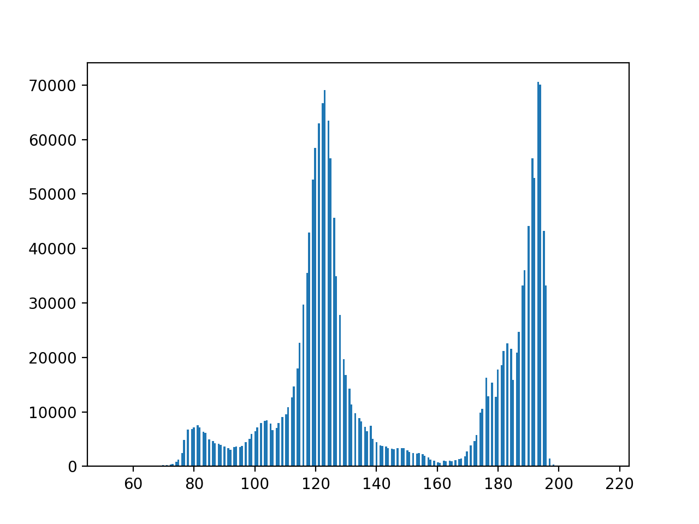
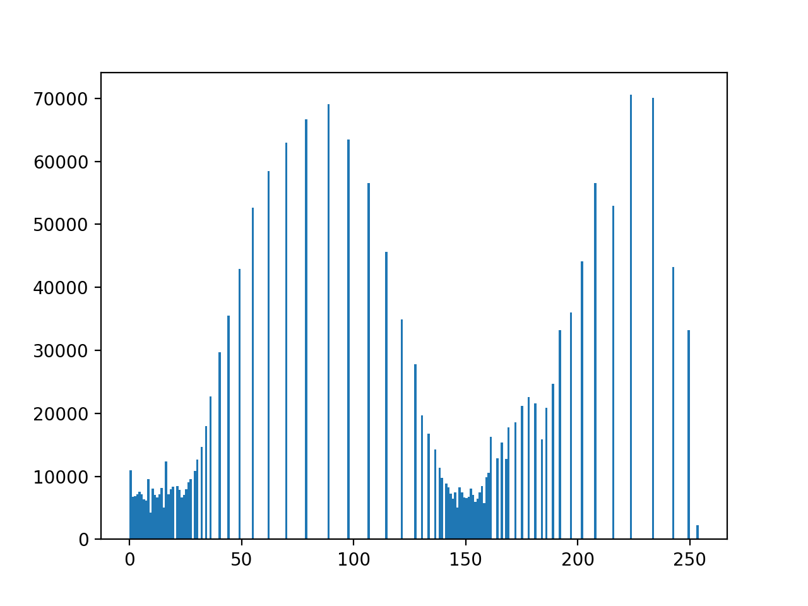
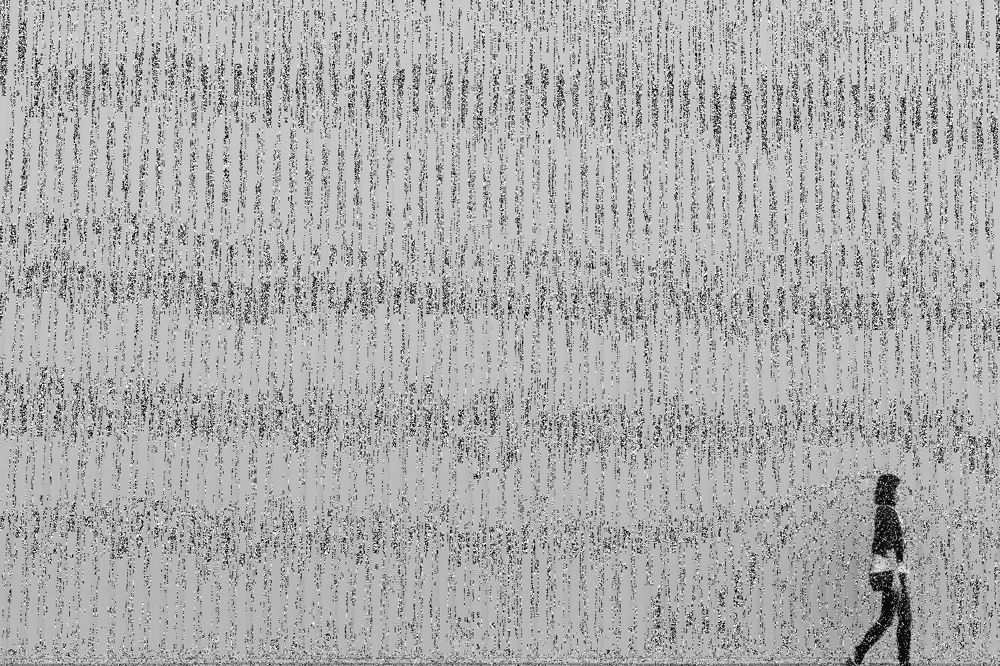
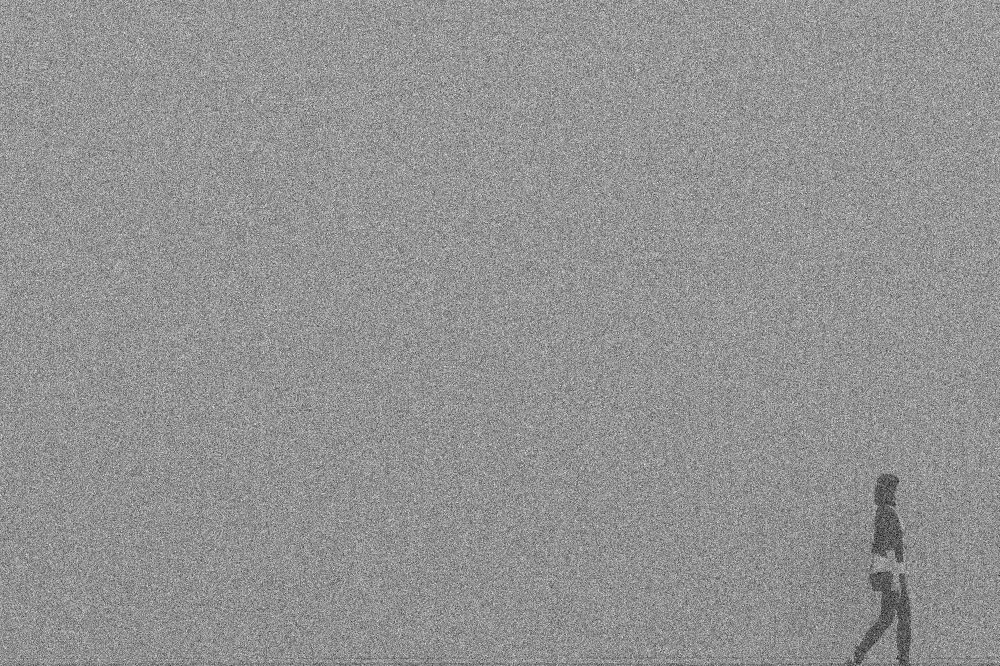

### 课堂作业

#### 2. 打开一副低对比度图像，拉伸其图像，直方图均衡。

##### - 打开一副低对比度图像，拉伸其图像

```python
def part_one():
    """
    打开一副低对比度图像，拉伸其图像
    """
    with open("source.jpeg", "rb") as fp:
        # open image
        im = Image.open(fp).convert("L")
        # reducing contrast
        im_contrasted = ImageEnhance.Contrast(im).enhance(0.5)
        im_contrasted.save("slowdown_source.jpeg")
    
    with open("slowdown_source.jpeg", "rb") as fp:
        # open image
        im = Image.open(fp)
        im.show()

        im_arr = np.asarray(im)
        rmin = np.min(im_arr)
        rmax = np.max(im_arr)
        im_converted_arr = np.empty(im_arr.shape, dtype=np.uint8)
        for j in range(im_arr.shape[0]):
            for i in range(im_arr.shape[1]):
                im_converted_arr[j][i] = (im_arr[j][i] - rmin) / (rmax - rmin) * 255
        im_converted = Image.fromarray(im_converted_arr)
        im_converted.show()
        im_converted.save("stretching.jpeg")
```


##### - 直方图均衡

```python
def part_two():
    """
    直方图均衡
    """
    with open("source.jpeg", "rb") as fp:
        # open image
        im = Image.open(fp).convert("L")
        # reducing contrast
        im_contrasted = ImageEnhance.Contrast(im).enhance(0.5)
        im_contrasted.save("slowdown_source.jpeg")

    with open("slowdown_source.jpeg", "rb") as fp:
        im = Image.open(fp)
        im.show()

        im_arr = np.asarray(im)
        # 显示输入直方图
        plt.hist(im_arr.reshape([im_arr.size]), 256)
        plt.show()

        x = np.zeros([256])
        for i in range(im_arr.shape[0]):
            for j in range(im_arr.shape[1]):
                x[im_arr[i][j]] += 1
        x = x / im_arr.size

        sum_x = np.zeros([256])
        for i, _ in enumerate(x):
            sum_x[i] = sum(x[:i])

        im_converted_arr = np.empty(im_arr.shape, dtype=np.uint8)
        for i in range(im_arr.shape[0]):
            for j in range(im_arr.shape[1]):
                im_converted_arr[i][j] = 255 * sum_x[im_arr[i][j]]

        # 显示输出直方图
        plt.hist(im_converted_arr.reshape([im_converted_arr.size]), 256)
        plt.show()

        im_converted = Image.fromarray(im_converted_arr)
        im_converted.show()
        im_converted.save("histogramed.jpeg")
```






*****

#### 完整 Code

```python
import numpy as np
import math 
import matplotlib.pyplot as plt

from PIL import Image, ImageEnhance

'''
2. 打开一副低对比度图像，拉伸其图像，直方图均衡。
'''

def Log():
    aLog = [0]*256
    for i in range(1,256):
        aLog[i] = int(32*math.log(i,2))
    return aLog

def part_one():
    """
    打开一副低对比度图像，拉伸其图像
    """
    with open("source.jpeg", "rb") as fp:
        # open image
        im = Image.open(fp).convert("L")
        # reducing contrast
        im_contrasted = ImageEnhance.Contrast(im).enhance(0.5)
        im_contrasted.save("slowdown_source.jpeg")

    # with open("slowdown_source.jpeg", "rb") as fp:
    #     # open image
    #     im = Image.open(fp)
    #     im.show()
    #     pixels = im.load()
    #     logs = Log()
    #     for i in range(im.size[0]): # for every pixel:
    #         for j in range(im.size[1]):
    #             # 反转变换
    #             # pixels[i, j] =  255 - pixels[i, j]
    #             # log 变换
    #             pixels[i, j] = logs[pixels[i, j]]
    #     # im.show()
    
    with open("slowdown_source.jpeg", "rb") as fp:
        # open image
        im = Image.open(fp)
        im.show()

        im_arr = np.asarray(im)
        rmin = np.min(im_arr)
        rmax = np.max(im_arr)
        im_converted_arr = np.empty(im_arr.shape, dtype=np.uint8)
        for j in range(im_arr.shape[0]):
            for i in range(im_arr.shape[1]):
                im_converted_arr[j][i] = (im_arr[j][i] - rmin) / (rmax - rmin) * 255
        im_converted = Image.fromarray(im_converted_arr)
        im_converted.show()
        im_converted.save("stretching.jpeg")


def part_two():
    """
    直方图均衡
    """
    with open("source.jpeg", "rb") as fp:
        # open image
        im = Image.open(fp).convert("L")
        # reducing contrast
        im_contrasted = ImageEnhance.Contrast(im).enhance(0.5)
        im_contrasted.save("slowdown_source.jpeg")

    with open("slowdown_source.jpeg", "rb") as fp:
        im = Image.open(fp)
        im.show()

        im_arr = np.asarray(im)
        # 显示输入直方图
        plt.hist(im_arr.reshape([im_arr.size]), 256)
        plt.show()

        x = np.zeros([256])
        for i in range(im_arr.shape[0]):
            for j in range(im_arr.shape[1]):
                x[im_arr[i][j]] += 1
        x = x / im_arr.size

        sum_x = np.zeros([256])
        for i, _ in enumerate(x):
            sum_x[i] = sum(x[:i])

        im_converted_arr = np.empty(im_arr.shape, dtype=np.uint8)
        for i in range(im_arr.shape[0]):
            for j in range(im_arr.shape[1]):
                im_converted_arr[i][j] = 255 * sum_x[im_arr[i][j]]

        # 显示输出直方图
        plt.hist(im_converted_arr.reshape([im_converted_arr.size]), 256)
        plt.show()

        im_converted = Image.fromarray(im_converted_arr)
        im_converted.show()
        im_converted.save("histogramed.jpeg")

def main():
    part_one()
    part_two()

if __name__ == "__main__":
    main()
```

*****

#### 3. 对一副图像加噪声，进行平滑，锐化作用。

##### - 对一副图像加噪声(椒盐噪声)

```python
def part_one_1():
    """
    对一副图像加噪声(椒盐噪声)
    """
    with open("source2.jpeg", "rb") as fp:
        im = Image.open(fp).convert("L")
        im.show()
        im.save("gray_source2.jpeg")

        im_arr = np.asarray(im)
        im_converted_arr = deepcopy(im_arr)
        for i, m in enumerate(im_arr):
            for j, n in enumerate(m):
                if n % 5 == 0:
                    im_converted_arr[i][j] = choice((0, 255))

        im = Image.fromarray(im_converted_arr)
        im.show()
        im.save("salt_noise.jpeg")
```




##### - 对一副图像加噪声(高斯噪声)

```python
def part_one_2():
    
    """
    对一副图像加噪声(高斯噪声)
    """
    with open("source2.jpeg", "rb") as fp:
        im = Image.open(fp).convert("L")
        im.show()
        im.save("gray_source2.jpeg")
        
        im_wigth, im_height = im.size

        im_arr = np.asarray(im)
        # 添加均值为 0, 标准差为 64 的加性高斯白噪声
        random_arr = np.random.normal(0, 64, (im_height, im_wigth))
        im_converted_arr = im_arr + random_arr
        # 对比拉伸
        im_converted_arr = im_converted_arr - np.full((im_height, im_wigth), np.min(im_converted_arr))
        im_converted_arr = im_converted_arr * 255 / np.max(im_converted_arr)
        im_converted_arr = im_converted_arr.astype(np.uint8)
        im = Image.fromarray(im_converted_arr)
        im.show()
        im.save("gauss_noise.jpeg")
```



